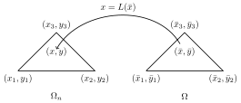
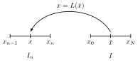

## Two Dimensional Fractal Integration
```@raw html
<center>
    
</center>
```

```math
    \begin{aligned}
    w_n
    \begin{bmatrix}
    &x \\
    &y \\
    &z \\
    \end{bmatrix}
    = 
    \begin{bmatrix}
    \alpha_1^n & \alpha_2^n & 0 \\
    \alpha_3^n & \alpha_4^n & 0 \\
    \alpha_5^n & \alpha_6^n & \alpha_7^n
    \end{bmatrix}
    \begin{bmatrix}
    x \\ y \\ z
    \end{bmatrix} + \begin{bmatrix}
    \beta_1^n \\ \beta_2^n \\ \beta_3^n
    \end{bmatrix} 
     \; n = 1, \ldots, K,

    \end{aligned}

```
where $L_n : \Omega \mapsto \Omega^n$

We first start with
```math 
\begin{aligned}
  I =  \int_{\Omega} f(x,y)dx dy = \int_{\Omega} f(x,y)dx dy
\end{aligned}
```
where ``f`` is the fractal interpolation function, i.e. the interpolant. Since ``f(x,y)`` is the fixed point of ``Tf``, we have ``f(x,y) = Tf(x,y)``. Then,
```math
\begin{aligned}
    I
    = \int_{\Omega} Tf(x,y) dx dy
\end{aligned}
```
Since ``Tf(x,y) = F_n(L_n^{-1}(x,y), f(L_n^{-1}(x,y)))``, where, in case two dimensional integration, 
```math
\begin{aligned}
    L_n(x,y) &= 
    \begin{bmatrix}
    \alpha_1^n & \alpha_2^n \\
    \alpha_3^n & \alpha_4^n \\
    \end{bmatrix}
    \begin{bmatrix}
    x \\ y 
    \end{bmatrix} + \begin{bmatrix}
    \beta_1^n \\ \beta_2^n 
    \end{bmatrix} \\
    F_n(x, y, z) &= \alpha_5^n x + \alpha_6^n y + \alpha_7^n z  \beta_3^n 
\end{aligned}
```
We have,
```math
Tf(x,y) = \begin{bmatrix}
\alpha_5^n & \alpha_6^n
\end{bmatrix} L_n^{-1}(x,y) + \alpha_7^n f(L_n^{-1}(x,y))) + \beta_3^n
```
We can divide integral ``I`` into multiple subintervasl ``I_n``,

```math
\begin{aligned}
    I
    &= \int_{\Omega} F_n(L_n^{-1}(x,y), f(L_n^{-1}(x,y))) dx dy \\
    &= \sum_{n=1}^{K} \int_{\Omega_n} F_n(L_n^{-1}(x,y), f(L_n^{-1}(x,y))) dx dy 
\end{aligned}
```
To make the right hand side of the above equation look like the left hand side, we need to apply a suitable transformation. That is, we need to transform the integral ``\int_{I_n}`` over the subinterval ``I_n`` to the interpolation interval ``I``. 

ADD FIGURE


!!! note

    Consider the transformation ``L`` shown in the figure below where $\Omega_{n} \subset \mathbb{R}^{2}$ and $\Omega \subset \mathbb{R}^{2}$. 
    

    We have the following equality for the definite integrals.
    ```math
    \begin{aligned}
        I =  \int_{\Omega_n} h(X) dX = \int_{\Omega} h(L(\bar{X})) |J_L| d\bar{X} 

    \end{aligned}
    ```
    where $|J_L|$ is the determinant of the Jacobian of the transformation $L$.

Using the note given above, we can write 
```math 
\begin{aligned}
  \int_{\Omega_n} h(X) dX &= \int_{\Omega} h(L(\bar{X})) |J_L| d\bar{X} \\
  &= \sum_{n=1}^{K} \int_{\Omega}  F_n(L_n^{-1}(L_n(\bar{X})), f(L_n^{-1}(L_n(\bar{X})))) |J_L| d\bar{X} \\
  &= \sum_{n=1}^{K} \int_{\Omega}  F_n(\bar{X}, f(\bar{X})) |J_L| d\bar{X}
\end{aligned}
```
we can write, 

```math
\begin{aligned}
    I &= \sum_{n=1}^{K} \int_{\Omega} (\begin{bmatrix}
\alpha_5^n & \alpha_6^n
\end{bmatrix} \bar{X} + \alpha_7^n f(\bar{X}) + \beta_3^n) |J_L| d\bar{X} \\
&= \sum_{n=1}^{K} \int_{\Omega} (\begin{bmatrix}
\alpha_5^n & \alpha_6^n
\end{bmatrix} \bar{X} + \beta_3^n) |J_L| d\bar{X} + \sum_{n=1}^{K} \int_{\Omega} \alpha_7^n f(\bar{X}) |J_L| d\bar{X} \\
&= \sum_{n=1}^{K} \int_{\Omega} ( \alpha_5^n x + \alpha_6^n y + \beta_3^n) |J_L| dx dy + \sum_{n=1}^{K} \int_{\Omega} \alpha_7^n f(x,y ) |J_L| dx dy \\
&= \sum_{n=1}^{K} \int_{\Omega} ( \alpha_5^n x + \alpha_6^n y + \beta_3^n) |J_L| dx dy +  \int_{\Omega}  f(x,y ) dx dy\sum_{n=1}^{K}\alpha_7^n |J_L|
\end{aligned}
```


We have,

```math
I = \frac{\gamma}{1 - \rho}
```

where 
```math
\gamma = \sum_{n=1}^{K} \int_{\Omega} ( \alpha_5^n x + \alpha_6^n y + \beta_3^n) |J_L| dx dy
```
and 
```math 
\rho = \sum_{n=1}^{K}\alpha_7^n |J_L|
```